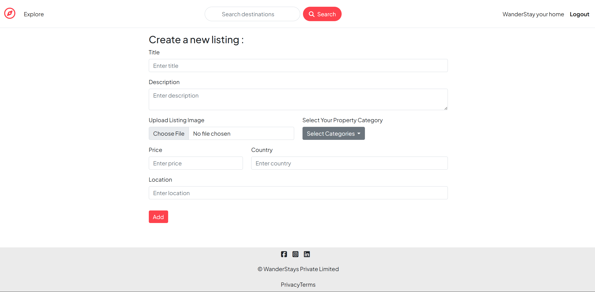
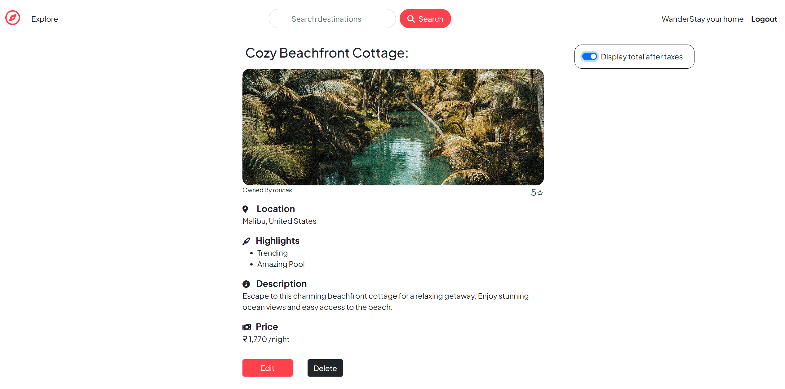
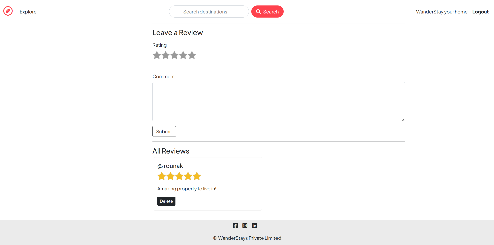

#  WanderStays

**WanderStays**is a full-stack web application that allows users to explore, create, manage, and review unique travel listings from all around the world. Designed with both travelers and hosts in mind, the platform provides an interactive experience for discovering distinctive stays ranging from cozy mountain cabins to luxurious seaside homes.

Users can register securely, create personalized listings with images, set pricing and locations, and categorize properties under themes such as 'farm stays', 'dome homes', or 'iconic city escapes'. Travelers can browse listings, leave reviews, and view aggregated ratings to make informed decisions.

With robust backend support, image uploads via Cloudinary, seamless user authentication, and dynamic category-based filtering, WanderStays delivers an intuitive, feature-rich environment for discovering and sharing exceptional accommodations across the globe.

## ✨ Features

* 🔐 **Secure User Authentication**: Registration and login with Passport.js using password hashing and salting for enhanced security  
* 🏡 **Listing Management**: Create, edit, and delete listings with image uploads powered by Cloudinary and Multer  
* 🌟 **Review System**: Add and delete star-based reviews with live average rating calculations  
* 🗂 **Filtering and Search**: Filter listings by category and search by location or country  
* 📸 **Image Hosting**: Seamless image upload and storage via Cloudinary  
* 📱 **Responsive Design**: Fully responsive UI using EJS templates and Bootstrap  
* 🔔 **Flash Messages**: Informative real-time user feedback on actions and errors  
* 🧠 **Data Validation**: Robust user input validation with Joi for data integrity and security  

## 🛠️ Tech Stack

| Layer       | Technologies                   |
| ----------- | ------------------------------ |
| Backend     | Node.js, Express.js            |
| Database    | MongoDB, Mongoose              |
| Authentication | Passport.js, bcrypt (hashing & salting) |
| File Upload | Multer, Cloudinary             |
| Frontend    | EJS, ejs-mate, Bootstrap       |
| Validation  | Joi                            |
| UX Helpers  | connect-flash, method-override |

## 🚀 Installation

1. **Clone the Repository**

   ```bash
   git clone https://github.com/your-username/WanderStays.git
   cd WanderStays
   ```

2. **Install Dependencies**

   ```bash
   npm install
   ```

3. **Configure Environment Variables**

   Create a `.env` file in the root directory:

   ```
   ATLAS_DB=<your MongoDB Atlas URI>
   SECRET=<your session secret>
   CLOUD_NAME=<your Cloudinary cloud name>
   CLOUD_API_KEY=<your Cloudinary API key>
   CLOUD_API_SECRET=<your Cloudinary API secret>
   ```

4. **Start the Application**

   ```bash
   npm start
   ```

5. **Visit in Browser**

   ```
   http://localhost:3000
   ```

## 📁 Project Structure

```
WanderStays/
├── app.js                 # Main application setup
├── cloudConfig.js         # Cloudinary config for uploads
├── controllers/           # Controllers for routes (listings, reviews, users)
├── middleware.js          # Custom middleware (auth, validation, etc.)
├── models/                # Mongoose schemas (Listing, Review, User)
├── routes/                # Express route handlers
├── utils/                 # Helpers (ExpressError, async wrapper, etc.)
├── views/                 # EJS templates
├── public/                # Static assets (CSS, JS, images)
├── init/                  # Seed and initialization scripts
├── .env                   # Environment variables
├── package.json           # Dependencies and scripts
└── README.md              # Project documentation
```

## 🧪 Features in Action

* **🔐 Secure login** – Users can register and login with password hashing.
* **📝 Add reviews** – Users can post star-based reviews with real-time average rating updates.
* **🖼️ Upload images** – Easily upload and manage listing images.
* **🗯️ Search listings** – Search listings by country or location.
* **🏷️ Category filters** – Quickly browse by listing types: `trending`, `mountain`, `castle`, etc.

## 📸 Demo
<p align="center">
  
  <br/>
  
  <br/>
  
  <br/>
  
</p>

## 🧑‍💻 Author

* **Rounak Agarwal**
  [GitHub](https://github.com/Rounakag16) | [LinkedIn](https://www.linkedin.com/in/agarwalrounak16/)

## 📄 License

This project is licensed under the **ISC License**.